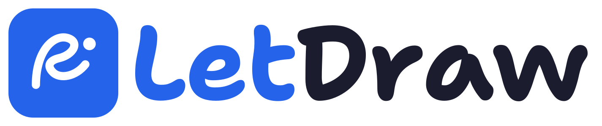

<p align="center">
  <a href="https://letdraw.com">
    <picture>
      <source media="(prefers-color-scheme: dark)" srcset="docs/assets/letdraw-logo-dark.svg">
      
    </picture>
  </a>
</p>

<h1 align="center">LetDraw MCP + REST</h1>

<p align="center">
  Connect AI assistants and your own scripts to <a href="https://letdraw.com">LetDraw</a> —
  read and author diagrams in your account through the
  <b>Model Context Protocol (MCP)</b> or the <b>public REST API</b>.
</p>

<p align="center">
  <a href="LICENSE"></a>
  
  
</p>

LetDraw is a hand-drawn–style online whiteboard and diagramming app. With this
integration an MCP client (Claude, Cursor, VS Code, Codex, …) or any HTTP client
can list workspaces, create and update diagrams, build a diagram from code
(compose / Kubernetes / DOT / Terraform / SQL / …), stamp real product icons,
export to Mermaid or D2, and share read-only links.

> This repository ships the **client-side integration**: a zero-config MCP
> bridge, a typed REST SDK, the API spec, and setup docs. The LetDraw app and
> server are not part of this repo.

## What's here

| Path | What it is |
|---|---|
| [`packages/mcp`](packages/mcp) | `@letdraw/mcp` — zero-config stdio bridge to the hosted MCP server (`npx @letdraw/mcp`) |
| [`packages/sdk`](packages/sdk) | `@letdraw/sdk` — typed REST client for scripting |
| [`spec/mcp-tools.md`](spec/mcp-tools.md) | The MCP tools, resources, and scopes |
| [`spec/openapi.yaml`](spec/openapi.yaml) | OpenAPI 3.1 spec for the REST API |
| [`spec/capabilities.md`](spec/capabilities.md) | "How to draw well in LetDraw" guide for AI clients |
| [`docs/`](docs) | Getting started + per-client setup (Claude, Cursor, VS Code, Codex) |
| [`examples/`](examples) | Copy-paste recipes |

## Endpoints

```
REST base   https://api.letdraw.com/api-v1
MCP URL     https://api.letdraw.com/mcp
```

Both authenticate with a **personal API token** (`Authorization: Bearer
ld_live_…`), not a login session. Create one in the LetDraw app under
**Account → Developer**. The exact URLs and a ready-to-paste client config are
shown there too.

## 60-second start (MCP)

The hosted server speaks Streamable-HTTP, so most clients connect directly. For
a stdio client, or for the simplest possible setup, use the bridge:

```jsonc
// Claude Desktop — claude_desktop_config.json
{
  "mcpServers": {
    "letdraw": {
      "command": "npx",
      "args": ["-y", "@letdraw/mcp"],
      "env": { "LETDRAW_TOKEN": "ld_live_YOUR_TOKEN" }
    }
  }
}
```

See [docs/clients](docs/clients) for Cursor, VS Code, Claude Code and Codex.

## 60-second start (REST)

```bash
curl https://api.letdraw.com/api-v1/workspaces \
  -H "Authorization: Bearer ld_live_YOUR_TOKEN"
```

Or with the SDK:

```ts
import { LetdrawClient } from '@letdraw/sdk';
const ld = new LetdrawClient({ token: process.env.LETDRAW_TOKEN! });
const { workspaces } = await ld.listWorkspaces();
```

## Scopes

Tokens carry scopes; each tool/route requires one:

- `diagrams:read` — list/get workspaces, folders, diagrams, icons
- `diagrams:write` — create/update/delete/share diagrams, from-code
- `export` — export to Mermaid / D2
- `ai:generate` — generate a diagram from a prompt (uses your own AI key)

## License

MIT — see [LICENSE](LICENSE). "LetDraw" and the LetDraw logo are trademarks of
their owner; see [NOTICE.md](NOTICE.md).
